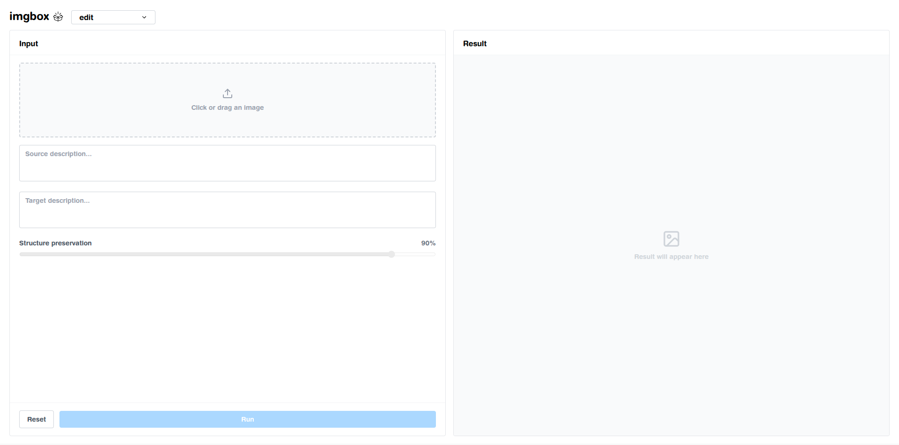

## Testing

Start backend

```bash
cd server && uv run uvicorn app:app --reload --port 8080
```

Start the UI

```bash
cd frontend && npm run dev
```

## Todo

- [ ] Ajouter clear cache option dans le panel de droite
- [ ] Renommer les items dans le drop down "edit" -> "sd3 + gommette edit", ainsi que les routes
- [ ] Mettre des pastilles i à côté des champs pour donner des indications
- [ ] estimation du temps
- [ ] dark theme ?
- [ ] mettre quelque chose qui agrandit l'image d'input
- [ ] on doit avoir un cue on hover pour indiquer qu'on peut widen l'image

## Valider les changements

```bash
git add .
git commit -m ""
git push origin main
```