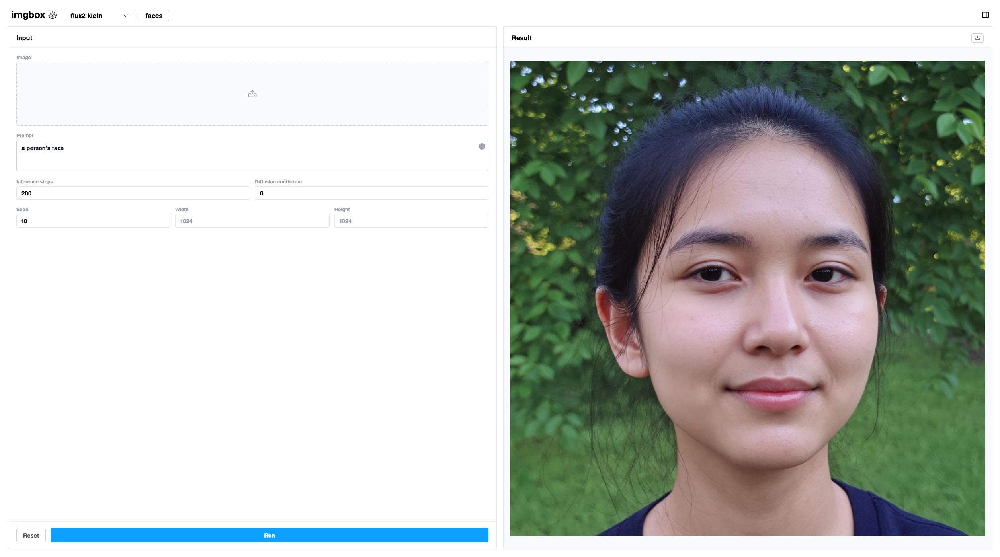

[](https://github.com/jrpll/imgbox/stargazers)

## Set up

First, get a HuggingFace account, [accept the Stable Diffusion 3 Medium license](https://huggingface.co/stabilityai/stable-diffusion-3-medium) and [get a token](https://huggingface.co/docs/hub/security-tokens) to be able to download models.

Then run this once:
```bash
cd frontend && npm install
npm run build
```

And then to start the app:
```bash
cd ../server && uv run python app.py
```

Drop the token in the right panel and you should be good to go. Please note, on the first run the models take a while to download.
You also need a 12GB GPU for the lightest edit mode based on Flux2-Klein-4B.

## Testing

For development, you can start backend like this:

```bash
cd server && uv run uvicorn app:app --reload --port 8080
```

And start the UI:

```bash
cd frontend && npm run dev
```

To emulate a brand-new user installing from scratch (Docker + GPU, real model download), see [docs/clean-install-test.md](docs/clean-install-test.md).

---

If imgbox is useful to you, a ⭐ goes a long way.