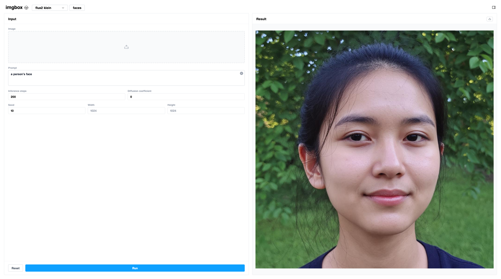

[](https://github.com/astral-sh/uv)
[](https://github.com/jrpll/imgbox/stargazers)

## Prerequisites

### OS and software requirements

The app is developed for Linux with NVIDIA gpu first, but has been tested and should run on macOS with MPS acceleration as well. The installation requires node as well as NVIDIA drivers.

You will need a 12GB GPU for the lightest edit mode based on Flux2-Klein-4B.

### HF token to download models
Get a HuggingFace account, [accept the Stable Diffusion 3 Medium license](https://huggingface.co/stabilityai/stable-diffusion-3-medium) as well as the [background removal model license](https://huggingface.co/briaai/RMBG-2.0) and get a token [here](https://huggingface.co/docs/hub/security-tokens). You will paste this token in the app once it is launched.

## Installation

Run the installation script:
```bash
bash install.sh
```

It installs [uv](https://docs.astral.sh/uv/) for smooth python environment management.

And then start the app with:
```bash
cd server && uv run python app.py
```

Drop the HF token in the right panel and you should be done. Please note, on the first run the models take a few minutes to download.


## Testing

For development, you can start backend like this:

```bash
cd server && uv run uvicorn app:app --reload --port 8080
```

And start the UI:

```bash
cd frontend && npm run dev
```

To emulate a brand-new user installing from scratch (Docker + GPU, real model download), see [docs/clean-install-test.md](docs/clean-install-test.md).

## Updating

Run this command to grab up-to-date code and install locally: 

```bash
git fetch origin && git reset --hard origin/main && bash install.sh
```

Please note this overrides any local change you may have done to the code.

---

If imgbox is useful to you, a ⭐ goes a long way.